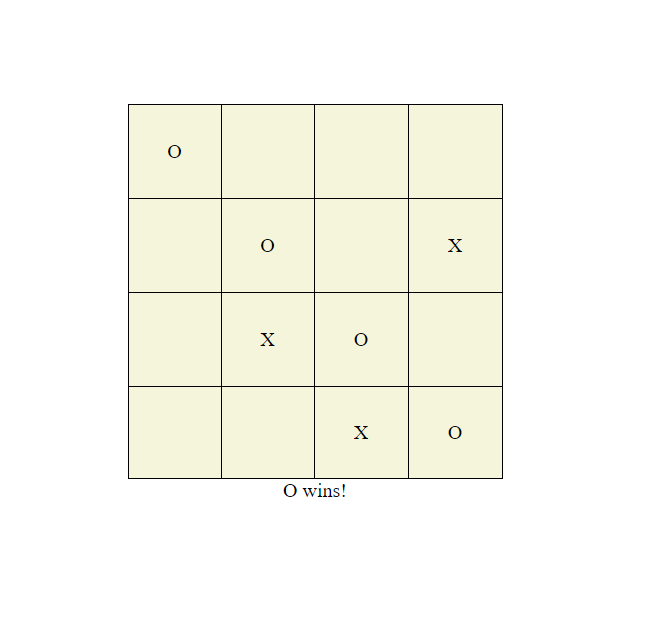
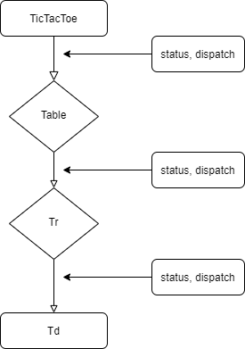
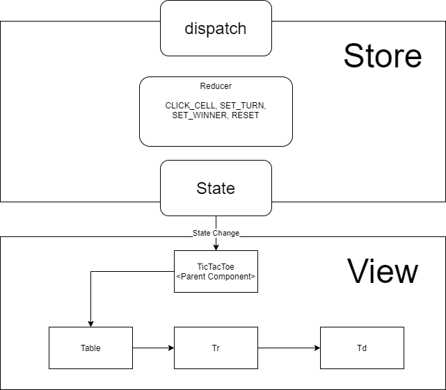
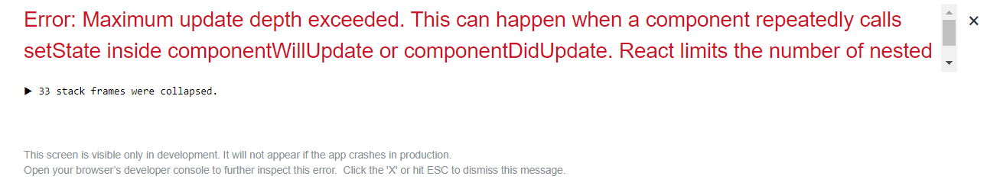

## Tic Tac Toe :game_die:

#### By Jiwon Han 4.29.2020 - 4.30.2020



A game in which two players seek in alternate turns to complete a row, a column, or a diagonal with either three O's or three X's drawn in the spaces of 4 rows x 4 colums.
 
There are two development modes: useReducer hook & react redux (4.30.2020)

### 1. useReducer hook

`const [state, dispatch] = useReducer(reducer, initialState);`

`useReducer` accepts a reducer function with the application initial state, returns the current application state, then dispatches a function.

Declared all statuses, actions, dispatch, reducers using `useReducer` in TicTacToe, upper most parent component and passed down those to children. 

Used `useEffect` Since dispatch is triggered **asynchronously**.

`useEffect` replaces componentDidMount and componentWillUpdate to handle any sort of events that occur after the component is mounted.

When cell is clicked on the board, the next step is to check same rows and columns to see if clicked cell matches with them. However, latest clicked cell or turn changes to the next before checking. To prevent this, `useEffect` was used.  

#### What's Included

```bash 
|-- components :
|   |-- TicTacToe.jsx
|   |   |-- const initialState
|   |   |-- action type modules (const SET_WINNER, const CLICK_CELL, const SET_TURN, const RESET)
|   |   |-- const reducer
|   |   |-- const [state, dispatch] = useReducer(reducer, initialState);
|   |   |-- useEffect()
|   |-- Table.jsx
|   |-- Tr.jsx 
|   |-- Td.jsx 
```

#### Comments on useReducer hook

 

It drills down props to the children. I even had to pass down dispatch from TicTacToe to TD. 
`useReducer` is one of the good React library that it still focus on the strong parent & child concept. It would be useful to use with `Context API`.  

#### To run useReducer dev mode locally:

```bash 
$ git clone https://github.com/jiwon-seattle/Tic-tac-toe-React-redux.git 
$ npm install
$ git reset --hard afd95b0eafcb735e7fca85752834b0dcfe7ec8b2
$ npm start
```
_If you encouter with initial npm packages issues, please delete `package-lock.json` file in the directory_

#### Packages that I used

`react-hot-loader`

### 1. react redux 



`Redux` is a popular JavaScript library for managing the state of your application. Since react consists of many components and it is easy to get complicated. It's good to use to manage state updates per actions.

Called SET_WINNER, SET_TURN, RESET dispatches in TicTacToe and CLICK_CELL in Td component.


When attemp to get turn props from store, I encounterd below error.

 

```bash
const mapStateToProps = (state) => ({
  turn: state.turn,
})
```

I guess that's because setTurn and getting turn happens at the same time.
I set another turn1 as impromptu state. 

```bash 
const mapStateToProps = (state) => ({
  turn1: state.turn1,
})
```

future homwork to solve this -> **react-thunk**

#### What's Included

```bash 
|-- actions
|   |-- actions.jsx
|-- components : handling views
|   |-- TicTacToe.jsx
|   |-- Table.jsx
|   |-- Tr.jsx 
|   |-- Td.jsx 
|-- reducers
|   |-- reducers.jsx : report externally
|-- reducers
|   |-- store.js : report externally
```

#### To run useReducer dev mode locally:

```bash 
$ git clone https://github.com/jiwon-seattle/Tic-tac-toe-React-redux.git
$ npm install
$ npm start 
```

#### Packages that I used

`react-hot-loader`
`react-redux`
