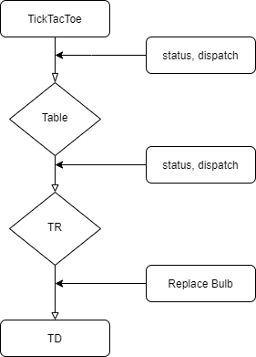

## Tic Tac Toe

#### By Jiwon Han 4.29.2020 - 4.30.2020

A game in which two players seek in alternate turns to complete a row, a column, or a diagonal with either three O's or three X's drawn in the spaces of 4 rows x 4 colums.
 
There are two development modes: useReducer hook & react redux (4.30.2020)

### useReducer hook

`const [state, dispatch] = useReducer(reducer, initialState);`

`useReducer` accepts a reducer function with the application initial state, returns the current application state, then dispatches a function.

Declared all statuses, actions, dispatch, reducers using `useReducer` in TicTacToe, upper most parent component and passed down those to children. 

Used `useEffect` Since dispatch is triggered Asynchronously.

`useEffect` replaces componentDidMount and componentWillUpdate to handle any sort of events that occur after the component is mounted.

When cell is clicked on the board, the next step is to check same rows and columns to see if clicked cell matches with them. However, latest clicked cell or turn changes to the next before checking. To prevent this, `useEffect` was used.  

#### Comments on useReducer hook

 

It drills down props to the children. I even had to pass down dispatch from TicTacToe to TD. 
`useReducer` is one of the good React library that it still focus on the strong parent & child concept. It would be useful to use with `Context API`.  

#### Packages that I used

`react-hot-loader`

